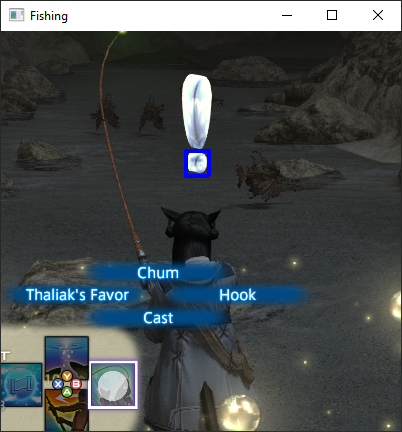

# FFXIV auto fishing script  
*==obviously use this at your own risk==*
### Features
    1. Template matches to know when a fish bites
    2. Controller Input works even on inactive window
    3. Not distracted by other fishers
    4. Doesnt touch network traffic or game files

### How to use  
Clone or download this repo
make sure your python environment has the dependencies in `requirements.txt`  
**for now** face body of water, try to match zoom of preview image.  
Cast line run script `python main.py`  

### Potential issues
FFXIV doesn't need to be active window, but the area wheres the !! marks appear over your character can't be obscured.  
If you have an actual controller active at the same you might get some interferences.    
Only tested on 2560x1440p.  

### The future  
cool shit hopefully :pensive:  

---
